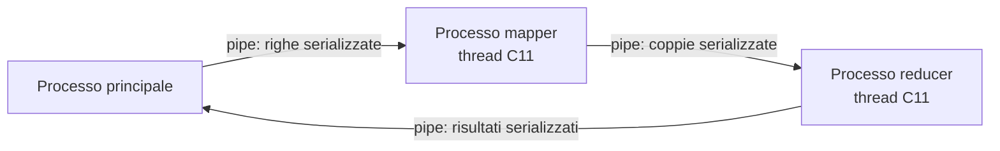
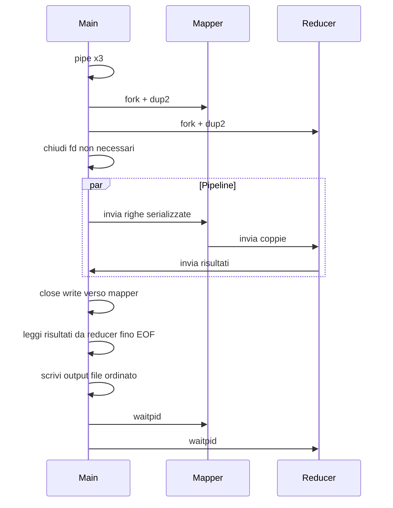

# Linea guida implementazione libmr (progetto base)

## Cosa devi costruire

Una **libreria statica** `libmr.a` esposta tramite [include/mr.h](include/mr.h), che implementa una pipeline a 3 processi:



**Vincoli tecnici non negoziabili:**

- `fork()`, `pipe()`, `dup2()`, `waitpid()` per i processi
- Thread **C11** (`<threads.h>`, `mtx_t`, `cnd_t`) — **no** `pthread_*`
- **No** socket, memoria condivisa, `exec()`
- EOF tramite **chiusura pipe**, non messaggi speciali
- `fork()` **prima** di creare thread nei figli
- Valori intermedi e risultati = **byte opachi** (no `strlen`/`strcmp` sui valori)

---

## Stato attuale del codice

In [src/mr.c](src/mr.c) hai solo bozze di `mr_attr_*` con diversi problemi da correggere come **primo passo**:

- `mr_attr_init()` non restituisce `0`/`-1`
- La logica dei default è invertita (azzeri i thread se `!= 1` invece di impostare default validi)
- `mr_attr_set_reducer_threads()` modifica `mapper_threads` per errore
- Mancano tutte le altre API e l’intera pipeline

**Default corretti** (da specifica sez. A): `mapper_threads >= 1`, `reducer_threads >= 1`, `queue_size > 0`, `log_file = NULL` → default `"mr.log"`.

---

## Struttura consigliata dei file

Organizza il codice in moduli piccoli (non tutto in `mr.c`):

| File                   | Responsabilità                                                   |
| ---------------------- | ---------------------------------------------------------------- |
| `src/mr.c`             | API pubblica: `mr_create`, `mr_start`, `mr_destroy`, attr        |
| `src/mr_internal.h`    | Tipi opachi (`struct mr`), costanti, prototipi interni           |
| `src/io.c`             | `readn`/`writen`, protocollo messaggi sulle pipe                 |
| `src/queue.c`          | Coda produttore-consumatore (`mtx_t` + `cnd_t`)                  |
| `src/log.c`            | Log sincronizzato (semaforo POSIX tra processi)                  |
| `src/input.c`          | Lettura file/directory, enumerazione lessicografica              |
| `src/mapper_proc.c`    | `mapper_process_main`, thread lettore + worker                   |
| `src/reducer_proc.c`   | `reducer_process_main`, raggruppamento + worker                  |
| `src/main_proc.c`      | Orchestrazione in `mr_start`: fork, invio righe, raccolta output |
| `examples/wordcount.c` | Esempio conteggio token                                          |
| `tests/`               | Test automatici per `make test`                                  |
| `Makefile`             | `all`, `test`, `clean`                                           |

---

## Fase 0 — Fondamenta (1-2 giorni)

### 0.1 Utility I/O

Implementa subito:

```c
ssize_t readn(int fd, void *buf, size_t n);   // legge esattamente n byte o errore/EOF
ssize_t writen(int fd, const void *buf, size_t n);
```

Ogni messaggio sulle pipe = **header con lunghezze `int`** + payload. Controlla:

- lunghezze **non negative**
- limite massimo documentato (es. 64 MiB) prima di convertire a `size_t`
- rifiuta messaggi troppo grandi

### 0.2 Definisci i formati (da documentare in relazione)

**Messaggio riga** (main → mapper) — il PDF non fissa il formato, scegli tu in modo coerente:

```
[int file_name_len][int line_len][unsigned long line_number]
[file_name_len byte][line_len byte]
```

**Messaggio coppia** (mapper → reducer), come da PDF:

```
typedef struct { int token_len; int value_len; } mr_pair_header_t;
// seguito da token_len byte + value_len byte
```

**Messaggio risultato** (reducer → main), analogo all’output file:

```
[int token_len][int result_len][token bytes][result bytes]
```

**File output** (scritto dal main): stesso schema dei risultati, **ordinati lessicograficamente per token**. Se un token produce più risultati, definisci e documenta l’ordine (es. ordine di emissione dal reducer).

### 0.3 Makefile minimo

Target `make` che produce `libmr.a` + un eseguibile esempio. Compila con `-std=c11 -pthread -Wall -Wextra`.

---

## Fase 1 — API e struttura opaca (mezza giornata)

### `struct mr` (in `mr_internal.h`)

Tieni qui: copia di `mr_attr_t`, puntatori a `mapper`/`reducer`/`user_arg`, fd log, contatori, flag errore.

### Funzioni attr

- `mr_attr_init` / `mr_attr_destroy`
- `mr_attr_set_*`: rifiuta `n == 0` per thread e queue
- `mr_create`: alloca `struct mr`, **copia** attr e callback (il chiamante può modificare `attr` dopo)
- `mr_destroy`: libera risorse (non ancora usate se non hai fatto `mr_start`)

---

## Fase 2 — Coda thread-safe (1 giorno)

Implementa una coda circolare generica:

```c
typedef struct {
    void **items;
    size_t cap, head, tail, count;
    mtx_t mtx;
    cnd_t not_full, not_empty;
    int closed;  // produttore ha finito
} mr_queue_t;
```

Operazioni: `init`, `destroy`, `push` (blocca se piena), `pop` (blocca se vuota), `close` (sveglia tutti i consumatori).

**Test isolato**: thread produttore + consumatore senza pipe né fork.

---

## Fase 3 — Log sincronizzato (mezza giornata)

Formato riga (da documentare):

```
[timestamp] [main|mapper|reducer] [thread_id] [evento] messaggio
```

- Default: `mr.log` se `log_file == NULL`
- Scritture da processi diversi: **semaforo POSIX** (`sem_open`/`sem_wait`/`sem_post`) o lock su file
- Eventi minimi richiesti: pipe, fork, thread start/stop, apertura file, contatori, errori

---

## Fase 4 — Lettura input nel processo principale (1 giorno)

In `input.c`:

1. Se `input_path` è file regolare → elabora solo quello
2. Se è directory → `readdir`, filtra file regolari, ordina **lessicograficamente** (non ricorsivo)
3. Per ogni file: leggi riga per riga
   - rimuovi `\n` finale se presente
   - gestisci file vuoti, righe vuote, ultima riga senza `\n`
   - `line_number` parte da 1
4. Serializza ogni riga sulla pipe verso mapper con `writen`
5. A fine input: **chiudi** il lato write della pipe main→mapper

Non fare fork in questa fase: testa inviando a un processo dummy che stampa/verifica i messaggi.

---

## Fase 5 — Processo mapper (2-3 giorni)

### Setup in `mapper_process_main`

Dopo `dup2`:

- stdin ← `main_to_mapper[0]`
- stdout ← `mapper_to_reducer[1]`
- chiudi **tutti** gli altri fd (inclusi write di pipe non usate)

### Thread

1. **Reader thread**: legge messaggi riga da stdin → `push` in coda righe; a EOF → `close` coda
2. **N worker thread** (`mapper_threads`): `pop` riga → costruisci `mr_file_line_t` → chiama `mapper` utente

### `emit` nel mapper

Quando il mapper utente chiama `emit(token, value, size, emit_arg)`:

- valida token (solo alfanumerico ASCII, terminato `\0`)
- **copia** value prima di ritornare da `emit`
- scrittura su stdout **protetta da mutex** (più worker scrivono sulla stessa pipe)
- serializza con header `token_len`/`value_len`

### Shutdown mapper

```
EOF stdin → reader chiude coda → worker finiscono righe in coda
→ join tutti i thread → close(stdout) UNA SOLA VOLTA
```

**Errore comune**: un worker chiude stdout → reducer riceve EOF prematuro e si blocca o perde dati.

---

## Fase 6 — Processo reducer (2-3 giorni)

### Setup analogo al mapper

stdin ← mapper, stdout ← main, chiudi fd inutili.

### Fase di raggruppamento (single-threaded o con reader dedicato)

1. **Reader thread**: legge coppie da stdin fino a EOF
2. Accumula in una struttura dati per token

**Struttura dati consigliata**: tabella hash o albero (es. lista ordinata + `bsearch`, oppure hash con chaining). Chiave = token (stringa). Valore = array dinamico di `mr_value_t` (copia byte per byte).

3. A EOF: hai tutti i gruppi completi

### Fase reduce

Per ogni token distinto (ordine lessicografico per output deterministico):

- costruisci `mr_value_t[]`
- invoca `reducer(token, values, count, emit, ...)`
- `emit` copia il risultato e lo mette in una lista risultati (con mutex se multi-thread)

### Thread reducer (opzionale nella prima versione)

Strategia semplice e corretta:

1. Prima versione: **un solo thread** fa tutto il reduce dopo il raggruppamento
2. Poi parallelizza: partiziona i token tra `reducer_threads` worker (hash del token % N) — **non serve addendum**, è solo parallelismo interno

### Shutdown reducer

Scrivi tutti i risultati su stdout (mutex se multi-thread) → `close(stdout)`

**Regola critica**: `reducer` utente viene chiamato **una volta per token**, non per ogni coppia.

---

## Fase 7 — Orchestrazione in `mr_start` (1-2 giorni)

Sequenza nel processo principale:



Passi concreti:

1. `pipe()` × 3 (controlla errori)
2. `fork()` mapper → nel figlio: `dup2`, chiudi fd, `mapper_process_main`, `_exit`
3. `fork()` reducer → analogo
4. Nel main: tieni solo `main_to_mapper[1]` (write) e `reducer_to_main[0]` (read)
5. Thread o loop nel main: invia righe + leggi risultati (puoi farlo sequenzialmente: prima invio tutto, poi leggo — più semplice)
6. Scrivi file output con record length-prefixed, token ordinati
7. `waitpid` su entrambi i figli; propaga exit code se errore

`mr_start` è **bloccante**: ritorna solo a elaborazione finita o errore.

---

## Fase 8 — Esempio wordcount (mezza giornata)

In `examples/wordcount.c`:

**Mapper**: estrai token alfanumerici dalla riga (scorri `line`/`line_len` senza assumere `\0`), per ogni token:

```c
int one = 1;
emit(token, &one, sizeof(one), emit_arg);
```

**Reducer**: somma gli `int` ricevuti, emetti il totale serializzato.

Il framework **non** deve contenere questa logica — solo nell’esempio.

---

## Fase 9 — Test (1-2 giorni)

Crea `tests/` con casi minimi:

| Test            | Cosa verifica                              |
| --------------- | ------------------------------------------ |
| `readn_writen`  | I/O parziale                               |
| `queue`         | blocco produttore/consumatore, close       |
| `empty_file`    | file vuoto → output vuoto                  |
| `single_line`   | una riga, con/senza `\n` finale            |
| `directory`     | ordine lessicografico file                 |
| `wordcount`     | output deterministico                      |
| `binary_value`  | valore con byte `\0` interni               |
| `multi_result`  | reducer che emette più risultati per token |
| `invalid_token` | mapper con token non alfanumerico → errore |

`make test` deve eseguire tutti i test e restituire exit code 0.

---

## Fase 10 — Relazione PDF (max 10 pagine)

Non ripetere la specifica. Documenta **le tue scelte**:

- architettura e diagramma processi/thread
- formato messaggi pipe (riga, coppia, risultato)
- struttura dati raggruppamento token
- formato output e log
- limiti sulle lunghezze
- ordine output con più risultati per token
- test eseguiti

---

## Ordine di implementazione consigliato (checklist)

1. Correggi `mr_attr_*` in [src/mr.c](src/mr.c)
2. `readn`/`writen` + test
3. Coda + test
4. Log base
5. Protocollo messaggi (funzioni serialize/deserialize)
6. Input reader (senza fork)
7. Mapper process isolato (input da file, output su file)
8. Reducer process isolato
9. `mr_start` completo con fork/dup2/waitpid
10. Scrittura file output ordinato
11. Esempio wordcount
12. Test suite + Makefile
13. Relazione

**Strategia debug**: implementa e testa ogni stadio **in isolamento** prima di collegare la pipeline completa. Il 90% dei blocchi viene da fd non chiusi o EOF prematuro.

---

## Trappole frequenti (memorizza queste)

1. **Fd aperti nel processo sbagliato** → nessun EOF, deadlock
2. **stdout chiuso da un worker** → reducer legge EOF troppo presto
3. **Scritture concorrenti sulla pipe senza mutex** → messaggi mescolati
4. **`strlen` su valori opachi** → comportamento indefinito
5. **`fork` con thread già attivi nel padre** → comportamento indefinito in Linux
6. **Non copiare dati in `emit`** → dati corrotti se il buffer utente viene riusato
7. **Puntatori in `mr_file_line_t` validi solo durante la callback** → copia se serve persistenza
8. **Output non deterministico** → ordina token lessicograficamente

---

## Consegna finale

Archivio `.zip` con: `include/`, `src/`, `examples/`, `Makefile`, `README`, `Relazione.pdf`. Target: `make`, `make test`, `make clean`.
